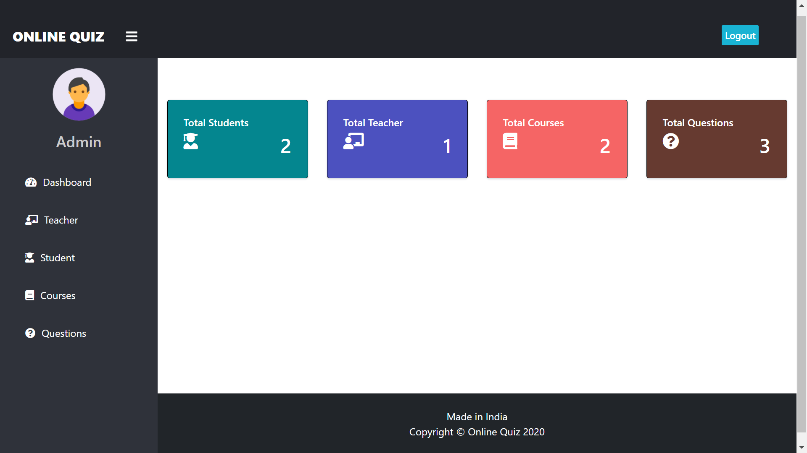

# Online Quiz Management System

A Django-based web application for managing online quizzes/exams with three separate roles  **Admin**, **Teacher**, and **Student** — each with their own dashboard and permissions.
**4th Semester WEB TECHNOLOGIES Project**
**Made By: Sawera Mushtaq**

---

## ✨ Features

### Admin
- Login as admin (`createsuperuser`)
- View total number of students, teachers, courses, and questions on the dashboard
- View, update, delete, and approve teachers
- View, update, and delete students
- View student marks
- Add, view, and delete courses/exams
- Add questions to courses with options, correct answer, and marks
- View and delete questions

### Teacher
- Apply/register (requires admin approval before login)
- View dashboard stats (students, courses, questions)
- Add, view, and delete courses/exams
- Add, view, and delete questions

### Student
- Sign up (no approval required, instant login)
- View dashboard stats (courses, exams, questions)
- Attempt exams anytime, unlimited attempts
- View marks for every attempt of every exam
- MCQ format — 4 options, 1 correct answer

---

## 🛠️ Tech Stack
- **Backend:** Python, Django 3.0.5
- **Frontend:** HTML, CSS, Bootstrap 4
- **Database:** SQLite (default)

---

## 🚀 Getting Started

### Prerequisites
- Python 3.7+ installed (make sure to check "Add to PATH" during install)

### Installation


1. Create a virtual environment (recommended)
   ```bash
   python -m venv venv
   venv\Scripts\activate      # Windows
   source venv/bin/activate   # macOS/Linux
   ```

2. Install dependencies
   ```bash
   pip install -r requirements.txt
   ```

3. Apply migrations
   ```bash
   python manage.py makemigrations
   python manage.py migrate
   ```

4. Create an admin account
   ```bash
   python manage.py createsuperuser
   ```

5. Run the development server
   ```bash
   python manage.py runserver
   ```

6. Open your browser at
   ```
   http://127.0.0.1:8000/
   ```

### Demo Accounts (Pakistan-based)
This project includes a ready-made command that seeds one demo account for each role, using Pakistani addresses and mobile number formats:

```bash
python manage.py seed_demo_users
```

This creates:

| Role | Name | Username | Password |
|---|---|---|---|
| Admin | Sawera | `sawera` | `Sawera@123` |
| Teacher | Rehan | `rehan` | `Rehan@123` |
| Student | Ali | `ali` | `Ali@123` |

## 📸 Screenshots

| Homepage | Admin Dashboard |
|---|---|
|  |  |


---

## 📌 Known Limitations
- Admin/Teacher can add unlimited questions to a course, even though a fixed question count is set when the course is created.

